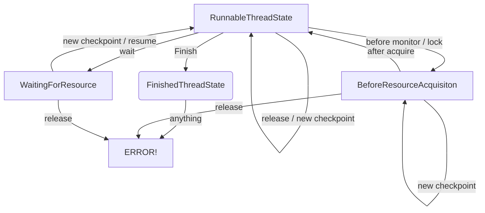

```mermaid
flowchart TD
    A[RunnableThreadState] -->|Finish| B(FinishedThreadState)
    B --> |anything| D
    A --> |release / new checkpoint| A
    A --> |before monitor / lock| C[BeforeResourceAcquisiton]
    C --> |new checkpoint| C
    C --> |after acquire| A
    C --> |release | D[ERROR!]
    A --> |wait| W[WaitingForResource]
    W --> |new checkpoint / resume | A
    W --> |release| D
```